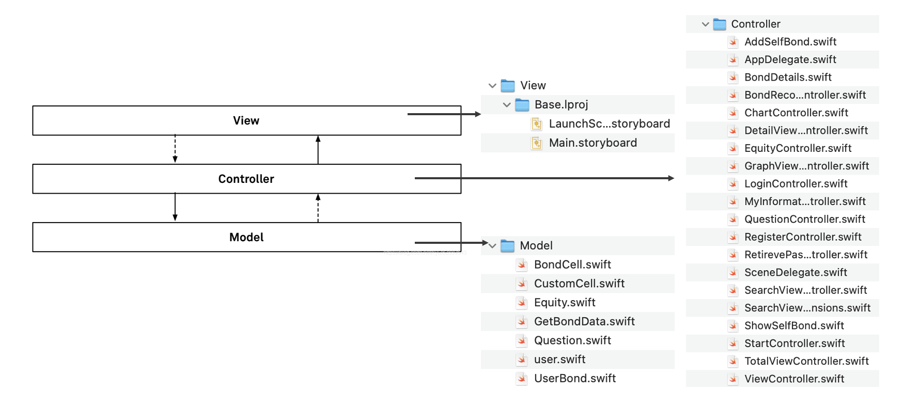
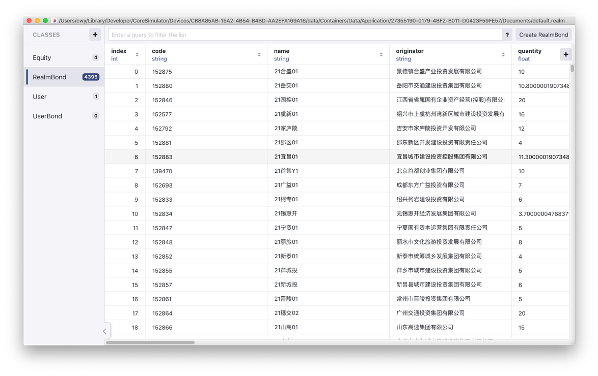
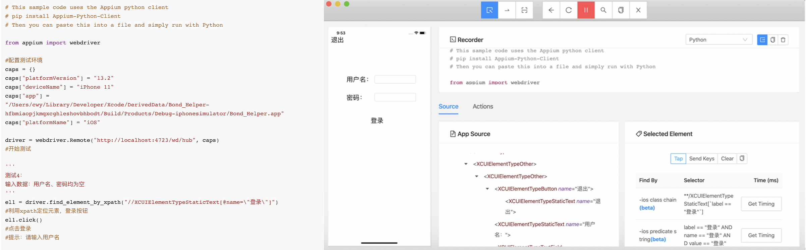
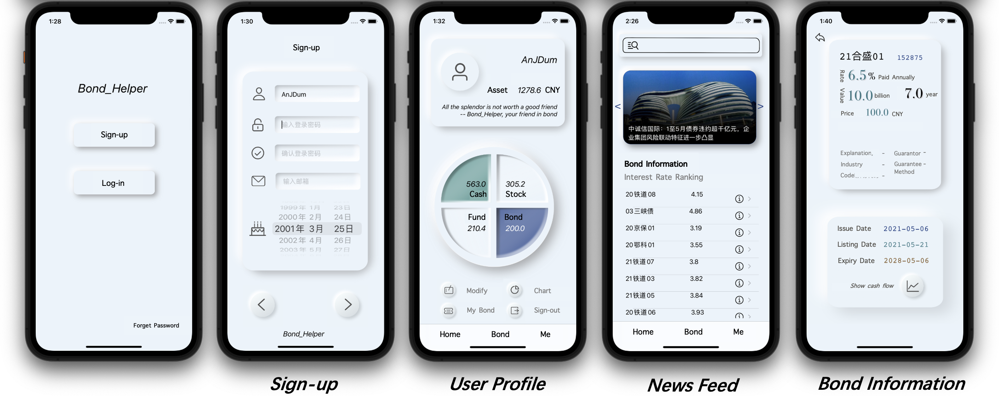

# Bond_Helper

## Introduction

The **Bond_Helper** app is tailored for individuals interested in investing in fixed-income bonds. The app analyzes users' risk preferences and asset allocation, helping them understand bond attributes and access real-time bond information. It provides reasoned recommendations for bond purchases, mitigating investment risks and enabling users to achieve optimized investment returns within their acceptable risk parameters.

## Architecture

The app employs the MVC (Model-View-Controller) pattern, facilitating organized and efficient development and maintenance.

## Technical Stack

- **Programming Language**: Swift
- **IDE**: XCode
- **Version Control**: Git
- **Package Manager**: Cocoapods
- **Database**: Realm (local storage) and MongoDB Realm (server deployment)
    
    
    
- **Testing Framework**: Appium for automated app testing.
    
    
    

## Setup and Configuration

1. Clone the repository from Gardenia.
2. Install dependencies using Cocoapods.
3. Open the project in XCode and run on an iOS 13.2 or higher device or simulator.
4. Configure Appium on a local machine for testing purposes.

## Features

- **User Account Management**: Sign-up and log-in functionality, with each email address being uniquely linked to a single user account. Account creation is available for users over the age of 18.
- **Password Recovery**: Dual verification through email and date of birth, with a prompt for successful verification.
- **Risk Profile Assessment**: Users complete a risk preference questionnaire sourced from the China Securities Regulatory Commission to help define their investment profiles.
- **Personal Information Management**: Real-time editing and updating of personal asset details with visual representation through charts.
- **Bond Information**: Comprehensive search and sorting of bond information to help users make informed decisions.
- **Asset Allocation Guidance**: Recommendations for asset allocation based on user risk profiles, ranging from conservative to aggressive strategies.
- **Bond Recommendations**: Tailored bond recommendations including government and corporate bonds based on user behavior and specific bond indices.
- **News Feed**: Carousel display of daily bond-related news, providing users with current market insights.